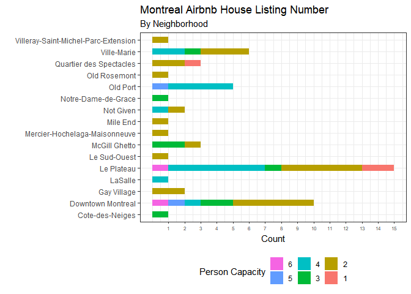
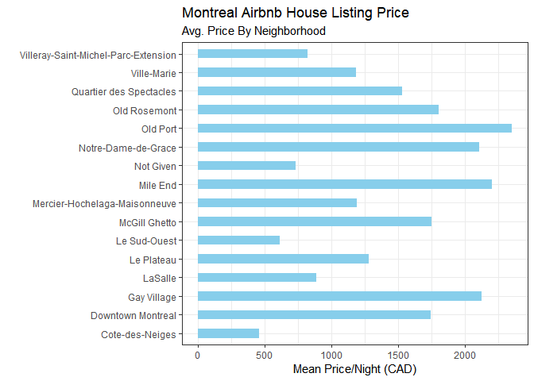
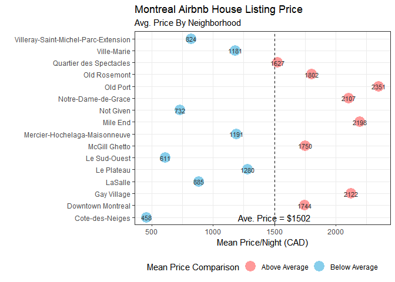
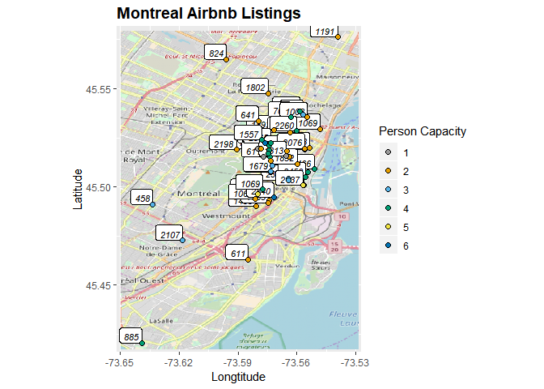

Data Visualization Example: Montreal Airbnb Listings
====================================================

利用Airbnb的搜尋房源結果繪製圖表，並與地圖結合

Data
----

利用上週 Web Crawling 的結果作為本週資料來源，主要會用到的變數為
`district` 、`lat` 、 `lng` 、 `person` 、 `price`

<table>
<thead>
<tr class="header">
<th>Data File</th>
<th>Variables</th>
<th>Class</th>
<th>Type</th>
</tr>
</thead>
<tbody>
<tr class="odd">
<td>house</td>
<td>district</td>
<td>factor</td>
<td>categorical</td>
</tr>
<tr class="even">
<td></td>
<td>lat</td>
<td>numeric</td>
<td>continuous</td>
</tr>
<tr class="odd">
<td></td>
<td>lng</td>
<td>numeric</td>
<td>continuous</td>
</tr>
<tr class="even">
<td></td>
<td>person</td>
<td>factor</td>
<td>categorical</td>
</tr>
<tr class="odd">
<td></td>
<td>price</td>
<td>numeric</td>
<td>continuous</td>
</tr>
</tbody>
</table>

    library(ggplot2)
    ## Read In Data
    house = read.csv("C:/Users/U430/Desktop/CSX Data Science/wk3/Montreal_Airbnb.csv")
    attach(house)
    house$title = as.character(house$title)
    house$person = as.factor(house$person)

    str(house)

    ## 'data.frame':    54 obs. of  9 variables:
    ##  $ title   : chr  "Urban Retreat in Amazing Location Loft" "SPACIOUS 2 BDRS - WALK EVERYWHERE - EASY CHECK-IN" "Charming & Cosy Room - Well Located" "Perfect Location Studio Apartment" ...
    ##  $ district: Factor w/ 16 levels "Cote-des-Neiges",..: 2 5 5 5 5 5 1 15 14 5 ...
    ##  $ lat     : num  45.5 45.5 45.5 45.5 45.5 ...
    ##  $ lng     : num  -73.6 -73.6 -73.6 -73.6 -73.6 ...
    ##  $ person  : Factor w/ 6 levels "1","2","3","4",..: 3 4 4 2 2 1 3 4 2 2 ...
    ##  $ bedrooms: int  0 2 1 0 0 1 1 0 1 1 ...
    ##  $ beds    : int  1 2 2 1 1 1 1 2 1 1 ...
    ##  $ type    : Factor w/ 2 levels "entire_home",..: 1 1 2 1 1 2 2 1 2 2 ...
    ##  $ price   : int  2870 885 794 947 1893 519 458 1191 1435 1252 ...

#### Reconstruct Data

因為需要繪製各地區平均價格的圖，因此另外整理了新的 dataframe `house2`

<table>
<thead>
<tr class="header">
<th>Data File</th>
<th>Variable</th>
<th>Class</th>
<th>Type</th>
</tr>
</thead>
<tbody>
<tr class="odd">
<td>house2</td>
<td>district.1</td>
<td>factor</td>
<td>categorical</td>
</tr>
<tr class="even">
<td></td>
<td>mean.price</td>
<td>numeric</td>
<td>continuous</td>
</tr>
<tr class="odd">
<td></td>
<td>max.price</td>
<td>numeric</td>
<td>continuous</td>
</tr>
<tr class="even">
<td></td>
<td>mean.price.type</td>
<td>factor</td>
<td>categorical</td>
</tr>
</tbody>
</table>

> mean.price.type為各地區平均價格與全體平均比較之結果

    ## Reconstruct Data
    district.1 = as.character(unique(district))
    mean.price = c()
    max.price = c()

    for(i in district.1) {
        mean.price = c(mean.price, mean(price[district == i])) ## Calculate district mean price
        max.price = c(max.price, max(price[district == i]))    ## Calculate district max price
    }

    house2 = data.frame(district.1, mean.price, max.price)

    ### Mean Price Index
    for(i in 1:16) {
      if(mean.price[i] > mean(price)) {
        house2$mean.price.type[i] = "Above Average"
      } else {
        house2$mean.price.type[i] = "Below Average"
      } 
     }

    str(house2)

    ## 'data.frame':    16 obs. of  4 variables:
    ##  $ district.1     : Factor w/ 16 levels "Cote-des-Neiges",..: 2 5 1 15 14 10 13 9 6 8 ...
    ##  $ mean.price     : num  1744 1280 458 1181 1527 ...
    ##  $ max.price      : int  2870 2565 458 2260 1832 763 1802 2198 611 1191 ...
    ##  $ mean.price.type: chr  "Above Average" "Below Average" "Below Average" "Below Average" ...

Graphics
--------

### 單一類別變數 -- Bar Chart

> 列出各Neighborhood房源數量，並以可居住人數作分類

    district.count = 
      ggplot(data = house, aes(x = district)) +
      geom_bar(width = 0.5, aes(fill = person))+
      coord_flip() +
      theme_bw() +
      theme(legend.position = "bottom", 
            axis.text.x = element_text(size = 6)) +
      scale_fill_discrete(name = "Person Capacity",
                          guide = guide_legend(reverse = TRUE)) +
      scale_y_continuous(breaks = seq(1,15,1), name = "Count") +
      scale_x_discrete(name = "") +
      labs(title = "Montreal Airbnb House Listing Number", subtitle = "By Neighborhood")
      
    ## Print Plot
    print(district.count)

### 類別變數 vs. 連續變數 -- Bar Chart

> 列出各Neighborhood平均房源價格

    district.price = 
      ggplot(data = house2, aes(x = district.1, y = mean.price)) +
      geom_bar(stat = "identity", width = 0.5, fill = "skyblue") +
      coord_flip() +
      theme_bw() +
      scale_x_discrete(name = "") +
      scale_y_continuous(name = "Mean Price/Night (CAD)") +
      labs(title = "Montreal Airbnb House Listing Price", subtitle = "Avg. Price By Neighborhood")

    ## Print Plot
    print(district.price)

### 類別變數 vs. 連續變數 -- Point Chart

> 標出各Neighborhood平均價格點後，並根據是否高於總體平均標註顏色

    price.comparison = 
      ggplot(data = house2, aes(x = district.1, y = mean.price, label = round((mean.price), digits = 0))) +
      geom_point(aes(col = mean.price.type), size = 6) +
      coord_flip() +
      theme_bw() +
      scale_color_manual(name = "Mean Price Comparison", 
                         labels = c("Above Average", "Below Average"), 
                         values = c("Above Average" = "#FF9999", "Below Average" = "skyblue")) +
      geom_text(color = "#333333", size = 3) +
      scale_x_discrete(name = "") +
      theme(legend.position = "bottom") +
      geom_hline(yintercept = 1502,linetype = "dashed") +
      annotate("text", y = 1502, x = 1, label = "Ave. Price = $1502", size = 4) +
      scale_y_continuous(name = "Mean Price/Night (CAD)") +
      labs(title = "Montreal Airbnb House Listing Price", subtitle = "Avg. Price By Neighborhood")

    ## Print Plot
    print(price.comparison)

Map Plot
--------

將資料點與`OpenStreetMap`地圖結合

> 載入OpenStreetMap地圖圖層

    library(OpenStreetMap)
    mtl.map = openmap(c(lat = 45.5800, lon = -73.6500), c(lat = 45.4177, lon = -73.5290),
                      type = "osm", zoom = 12)
    mtl.map.plot = autoplot(openproj(mtl.map))

> 於地圖圖層上利用ggplot2語法繪製座標點，並以價格作為標籤

    mtl.airbnb.price = mtl.map.plot +
      geom_label(data = house, aes(x = lng, y = lat, label = price, fontface = 3), size = 3, hjust = 1, vjust = 0) +
      geom_point(data = house, aes(x = lng, y = lat, fill = person), size = 2, shape = 21) +
      scale_fill_manual(name = "Person Capacity", values = c("#999999", "#E69F00", "#56B4E9", "#009E73", "#F0E442", "#0072B2")) +
      labs(title = "Montreal Airbnb Listings", x = "Longtitude", y = "Latitude") +
      theme(plot.title = element_text(face = "bold", size = 14))

    ## Print Plot
    print(mtl.airbnb.price)

後記
----

1.  ggplot2雖有基本的統計運算，但似乎不能直接計算類別平均或是做相關分類，需要另外再整理出表格來製圖

2.  `ggmap`
    package的`get_googlemap`目前都需要API來執行，因此另外選擇了`OpenStreetMap`，而此地圖開發者也直接製作了R
    package直接取用，缺點是地圖沒辦法放大縮小，這種有進階功能的圖層還是需要register
    API，但`OpenStreetMap`的API可透過註冊免費取得。
