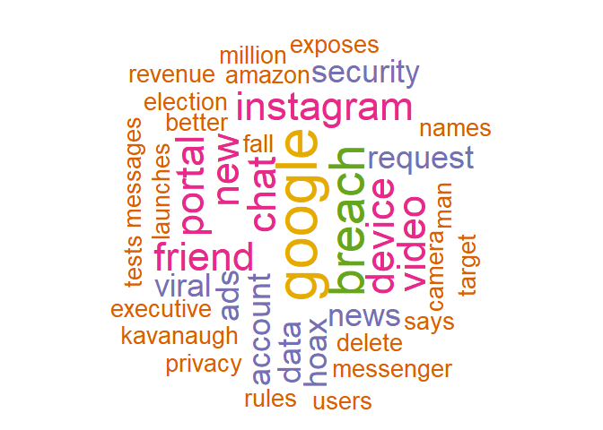
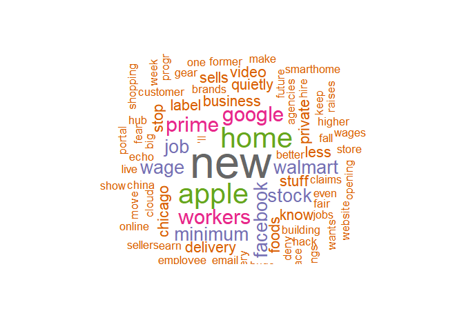

Text Mining: Google News Titles
-------------------------------

利用Google News搜尋結果，比較 Facebook, Amazon, Google
三日內的新聞標題，並完成下列幾項目標:

1.  利用文字雲了解多數媒體聚焦於哪些主題上

2.  比較三家公司的新聞標題及可能產生的觀感

### Read In Data

已將爬蟲結果儲存於相對應的 \*txt 檔中:

-   Facebook : 70筆

-   Amazon : 100筆

-   Google : 100筆

<!-- -->

    fb.data = readLines("C:/Users/U430/Desktop/CSX Data Science/wk4/hw4_wordcloud/Facebooknews.txt")
    amazon.data = readLines("C:/Users/U430/Desktop/CSX Data Science/wk4/hw4_wordcloud/Amazonnews.txt")
    google.data = readLines("C:/Users/U430/Desktop/CSX Data Science/wk4/hw4_wordcloud/Googlenews.txt")

### Transform Into Corpus Object

    library(tm)
    library(stringr)
    library(wordcloud)

    ## Preparation
    fb.doc = VectorSource(fb.data)
    amazon.doc = VectorSource(amazon.data)
    google.doc = VectorSource(google.data)

    fb.corpus = VCorpus(fb.doc)
    amazon.corpus = VCorpus(amazon.doc)
    google.corpus = VCorpus(google.doc)

### Data Cleang

    ## FB
    fb.corpus = tm_map(fb.corpus, content_transformer(tolower))
    fb.corpus = tm_map(fb.corpus, removePunctuation)
    fb.corpus = tm_map(fb.corpus, removeNumbers)
    stop = c(stopwords("en"), "facebook", "theres", "heres", "there", 
             "here", "'", "facebooks", "will", "just", "opinion", 
             "zuckerberg", "can", "smart", "post", "mark", "still", 
             "dont", "go", "come", "goes")
    fb.corpus = tm_map(fb.corpus, removeWords, stop)
    fb.corpus = tm_map(fb.corpus, stripWhitespace)

    ## Amazon
    amazon.corpus = tm_map(amazon.corpus, content_transformer(tolower))
    amazon.corpus = tm_map(amazon.corpus, removePunctuation)
    amazon.corpus = tm_map(amazon.corpus, removeNumbers)
    stop = c(stopwords("en"), "theres", "heres", "there", "here", "'", "will", 
             "just", "opinion", "can", "smart", "post", "still", "dont", "go",
             "come", "goes", "amazon", "says", "now", "may", "sell", "selling", 
             "top", "deals", "whole", "world", " ’ll", "addresses", "amazoncom", 
             "become", "area", "amazons")
    amazon.corpus = tm_map(amazon.corpus, removeWords, stop)
    amazon.corpus = tm_map(amazon.corpus, stripWhitespace)

    ## Google
    google.corpus = tm_map(google.corpus, content_transformer(tolower))
    google.corpus = tm_map(google.corpus, removePunctuation)
    google.corpus = tm_map(google.corpus, removeNumbers)
    stop = c(stopwords("en"), "theres", "heres", "there", "here", "'", "will", 
             "just", "opinion", "can", "smart", "post", "still", "dont", "go",
             "come", "goes", "google", "says", "now", "may", "googles", "news", 
             "gmail", "big", "calls", "get", "know", "admits", "announces","years", "friday",
             "revealed", "former", "search")
    google.corpus = tm_map(google.corpus, removeWords, stop)
    google.corpus = tm_map(google.corpus, stripWhitespace)

> 將不相關的文字或是相關的公司名稱、人物名稱去除後，希望能得到更有用的資訊

### Word Frequency Dataframe

    ## FB
    fb.tdm = TermDocumentMatrix(fb.corpus)
    fb.words.matrix = as.matrix(fb.tdm)
    fb.term = rowSums(fb.words.matrix)
    fb.term = sort(fb.term, decreasing = TRUE)
    fb.word.freq = data.frame(term = names(fb.term), num = fb.term)

    ## Aamazon
    amazon.tdm = TermDocumentMatrix(amazon.corpus)
    amazon.words.matrix = as.matrix(amazon.tdm)
    amazon.term = rowSums(amazon.words.matrix)
    amazon.term = sort(amazon.term, decreasing = TRUE)
    amazon.word.freq = data.frame(term = names(amazon.term), num = amazon.term)

    ## Google
    google.tdm = TermDocumentMatrix(google.corpus)
    google.words.matrix = as.matrix(google.tdm)
    google.term = rowSums(google.words.matrix)
    google.term = sort(google.term, decreasing = TRUE)
    google.word.freq = data.frame(term = names(google.term), num = google.term)

### Word Cloud

    ## FB
    fb.wc = wordcloud(fb.word.freq$term, fb.word.freq$num, 
              max.words = 100, min.freq = 2, random.order = FALSE, 
              rot.per = 0.35, colors = brewer.pal(6, "Dark2"))

    ## Amazon
    amazon.wc = wordcloud(amazon.word.freq$term, amazon.word.freq$num, 
              max.words = 100, min.freq = 2, random.order = FALSE, 
              rot.per = 0.35, colors = brewer.pal(8, "Dark2"))

    ## Google
    google.wc = wordcloud(google.word.freq$term, google.word.freq$num, 
              max.words = 100, min.freq = 2, random.order = FALSE, 
              rot.per = 0.35, colors = brewer.pal(8, "Dark2"))

### Comparison

1.  三家公司的新聞中皆大量出現彼此的名字，可見媒體正積極在將三家公司做比較，此處指的應該是三家公司各自推出最新的智慧家庭產品

2.  可以看到 `data` `user` `privacy`
    都在三家公司中佔了一定位置，代表目前媒體仍十分關注資安問題，以及隨著三家公司在各個領域的快速擴張，對於資料的使用方式也是媒體的報導焦點
