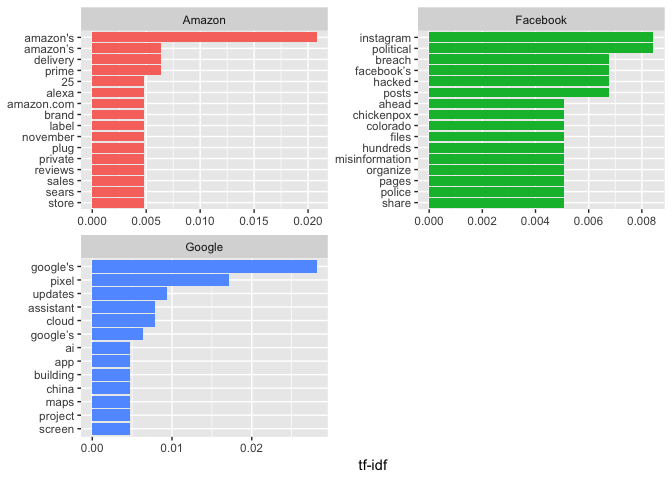
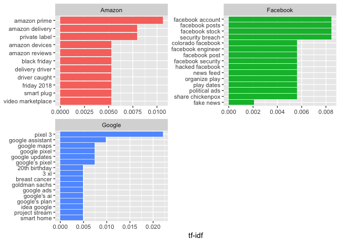

TF-IDF: Google News Titles
--------------------------

延續上週的主題，利用FB、AMAZON、GOOGLE、三家科技巨擘近日的新聞標題，利用TF-IDF概念找出三家公司各自的熱門關鍵字，並同時用了單字詞與雙字詞進行比較。

> 這邊所選擇的是`tidytext`package與`dplyr`函數的結合運用，參考 [Text
> Mining with R](https://www.tidytextmining.com/tfidf.html) 所完成的

    library(tidytext)
    library(dplyr)
    library(ggplot2)
    library(stringr)
    library(tidyr)

### Read In Data

    fb = readLines("/Users/wanjunghuang/Desktop/CSX_local/wk5/Facebooknews_1017.txt")
    google = readLines("/Users/wanjunghuang/Desktop/CSX_local/wk5/Googlenews_1017.txt")
    amazon = readLines("/Users/wanjunghuang/Desktop/CSX_local/wk5/Amazonnews_1017.txt")
    company = c(rep("Facebook", 100), rep("Amazon", 100), rep("Google", 100))
    news_title = data_frame(company = as.factor(company), title = c(fb,amazon,google))

    head(news_title)

    ## # A tibble: 6 x 2
    ##   company  title                                                          
    ##   <fct>    <chr>                                                          
    ## 1 Facebook Facebook Portal’s claims to protect user privacy are falling a…
    ## 2 Facebook Facebook is bringing back MTV’s The Real World                 
    ## 3 Facebook Advertisers Accuse Facebook of Knowingly Overestimating Video …
    ## 4 Facebook What To Do If Your Account Was Caught in the Facebook Breach   
    ## 5 Facebook Your Facebook Posts Can Reveal If You're Depressed             
    ## 6 Facebook The Facebook cleaners: 'I've seen hundreds of beheadings'

> 這裡加入`company`欄位作為不同公司的分類方式，並且以**dataframe**的方式儲存，因為`tidytext`函數輸入以dataframe格式為佳

### Tidy Text

    ## Break title into single words
    title.words = news_title %>%
      unnest_tokens(word, title) %>%
      count(company, word, sort = TRUE) %>%
      ungroup()

    head(title.words)

    ## # A tibble: 6 x 3
    ##   company  word         n
    ##   <fct>    <chr>    <int>
    ## 1 Facebook facebook    96
    ## 2 Amazon   amazon      81
    ## 3 Google   google      75
    ## 4 Amazon   to          39
    ## 5 Google   to          33
    ## 6 Facebook to          30

    ## Count total words in each category(ex: Total words in Facebook's titles)
    total.words = title.words %>% 
      group_by(company) %>%
      summarize(total = sum(n))

    head(total.words)

    ## # A tibble: 3 x 2
    ##   company  total
    ##   <fct>    <int>
    ## 1 Amazon    1124
    ## 2 Facebook  1033
    ## 3 Google    1118

    ## Eliminate stopwords
    title.words.clean = news_title %>%
      unnest_tokens(word, title) %>%
      anti_join(stop_words) %>%
      count(company, word, sort = TRUE) %>%
      ungroup()

    head(title.words.clean)

    ## # A tibble: 6 x 3
    ##   company  word         n
    ##   <fct>    <chr>    <int>
    ## 1 Facebook facebook    96
    ## 2 Amazon   amazon      81
    ## 3 Google   google      75
    ## 4 Google   google's    18
    ## 5 Amazon   amazon's    13
    ## 6 Google   google’s    11

    ## Join as dataframe
    title.words.combine = left_join(title.words.clean, total.words)
    head(title.words.combine)

    ## # A tibble: 6 x 4
    ##   company  word         n total
    ##   <fct>    <chr>    <int> <int>
    ## 1 Facebook facebook    96  1033
    ## 2 Amazon   amazon      81  1124
    ## 3 Google   google      75  1118
    ## 4 Google   google's    18  1118
    ## 5 Amazon   amazon's    13  1124
    ## 6 Google   google’s    11  1118

> 先利用`unnest_tokens`函數將句子分解成字元，接著用`anti_join`去除stopwords。

> 總字數的計算方式是先將dataframe照company分成三組，並利用**原始文字向量**製造新欄位`total`

### TF-IDF

    ## tf_idf
    title.word.idf = title.words.combine %>%
      bind_tf_idf(word, company, n) %>%
      select(-total) %>%
      arrange(desc(tf_idf))
      
    head(title.word.idf)

    ## # A tibble: 6 x 6
    ##   company  word          n      tf   idf  tf_idf
    ##   <fct>    <chr>     <int>   <dbl> <dbl>   <dbl>
    ## 1 Google   google's     18 0.0256   1.10 0.0281 
    ## 2 Amazon   amazon's     13 0.0189   1.10 0.0208 
    ## 3 Google   pixel        11 0.0156   1.10 0.0172 
    ## 4 Google   updates       6 0.00853  1.10 0.00938
    ## 5 Facebook instagram     5 0.00768  1.10 0.00844
    ## 6 Facebook political     5 0.00768  1.10 0.00844

> `tf`為文字出現次數除以文章總文字量，`idf`則是有了加權的概念

### Plot TF-IDF Graph

    ## Plot
    idf.plot = title.word.idf %>% arrange(desc(tf_idf)) %>%
      mutate(word = factor(word, levels = rev(unique(word)))) %>%
      group_by(company) %>%
      top_n(13) %>%
      ungroup %>%
      ggplot(aes(word, tf_idf, fill = company)) +
      geom_col(show.legend = FALSE) +
      labs(x = NULL, y = "tf-idf") +
      facet_wrap(~company, ncol = 2, scales = "free") +
      coord_flip()

    idf.plot

從此圖的結果我們可以發現三家公司近期各自主要的新聞議題，有幾點值得注意的地方：

-   Amazon
    的品牌名稱再做了tf-idf之後仍具非常大的重要性，也許Amazon的新聞標題寫法較為特別，而我們可以看到不少關於零售業的議題，像是`delivery`,`label`,`november`,`sears`等，可以看到最近媒體對於Amazon如何在本家事業上做出不少評論

-   FB主要仍圍繞在資安、政府與子公司的問題上，可見隨著美國大選的逼近，媒體對於社群網路的監管也越趨嚴格

-   Google
    多半集中在新產品及多樣化的雲端服務上，感覺媒體對於Google相關服務的發展關注的十分密切

### Bigram

這邊將進行雙字詞的分析，如 `facebook account`這樣的雙字詞

### Tidy Data - Bigram

    ## Extract bigram
    news.bigram = news_title %>%
      unnest_tokens(bigram, title, token = "ngrams", n = 2) %>%
      count(company, bigram, sort = TRUE)
    head(news.bigram)

    ## # A tibble: 6 x 3
    ##   company  bigram           n
    ##   <fct>    <chr>        <int>
    ## 1 Facebook on facebook      9
    ## 2 Google   pixel 3          9
    ## 3 Amazon   amazon is        7
    ## 4 Amazon   on amazon        5
    ## 5 Facebook facebook and     5
    ## 6 Facebook facebook is      5

    ## Sepearate 2 word
    news.bigram.seperate = news.bigram %>%
      separate(bigram, c("word1", "word2"), sep = " ")
    head(news.bigram.seperate)

    ## # A tibble: 6 x 4
    ##   company  word1    word2        n
    ##   <fct>    <chr>    <chr>    <int>
    ## 1 Facebook on       facebook     9
    ## 2 Google   pixel    3            9
    ## 3 Amazon   amazon   is           7
    ## 4 Amazon   on       amazon       5
    ## 5 Facebook facebook and          5
    ## 6 Facebook facebook is           5

    ## Eliminate stopwords
    news.bigram.filtered = news.bigram.seperate %>%
      filter(!word1 %in% stop_words$word) %>%
      filter(!word2 %in% stop_words$word) %>%
      filter(word1 != word2) 
    head(news.bigram.filtered)

    ## # A tibble: 6 x 4
    ##   company  word1    word2         n
    ##   <fct>    <chr>    <chr>     <int>
    ## 1 Google   pixel    3             9
    ## 2 Amazon   amazon   prime         4
    ## 3 Google   google   assistant     4
    ## 4 Amazon   amazon   delivery      3
    ## 5 Amazon   private  label         3
    ## 6 Facebook facebook account       3

    ## Reunite the string
    news.bigram.united = news.bigram.filtered %>%
      unite(bigram, word1, word2, sep = " ")
    head(news.bigram.united)

    ## # A tibble: 6 x 3
    ##   company  bigram               n
    ##   <fct>    <chr>            <int>
    ## 1 Google   pixel 3              9
    ## 2 Amazon   amazon prime         4
    ## 3 Google   google assistant     4
    ## 4 Amazon   amazon delivery      3
    ## 5 Amazon   private label        3
    ## 6 Facebook facebook account     3

> 設定bigram需要加上`token = "ngrams", n=2`的argument

> 因為雙字元無法直接清除停用字，因此要先將兩個字拆開，只要其中一個字元符合庭用字標準，就將之剔除，最後再將字拼回去

### TF-IDF - Bigram

    news.bigram.idf = news.bigram.united %>%
      bind_tf_idf(bigram, company, n) %>%
      arrange(desc(tf_idf))

    head(news.bigram.idf)

    ## # A tibble: 6 x 6
    ##   company  bigram               n      tf   idf  tf_idf
    ##   <fct>    <chr>            <int>   <dbl> <dbl>   <dbl>
    ## 1 Google   pixel 3              9 0.0201   1.10 0.0221 
    ## 2 Amazon   amazon prime         4 0.00964  1.10 0.0106 
    ## 3 Google   google assistant     4 0.00893  1.10 0.00981
    ## 4 Facebook facebook account     3 0.00767  1.10 0.00843
    ## 5 Facebook facebook posts       3 0.00767  1.10 0.00843
    ## 6 Facebook facebook stock       3 0.00767  1.10 0.00843

### Plot TF-IDF - Bigram

    bigram.plot = news.bigram.idf %>%
      filter(n!=1) %>%
      arrange(desc(tf_idf)) %>%
      mutate(bigram = factor(bigram, levels = rev(unique(bigram)))) %>%
      group_by(company) %>%
      top_n(15) %>%
      ungroup() %>%
      ggplot(aes(bigram, tf_idf, fill = company)) +
      geom_col(show.legend = FALSE) +
      labs(x = NULL, y = "tf-idf") +
      facet_wrap(~company, ncol = 2, scales = "free") +
      coord_flip()

    bigram.plot

使用bigram就可以更清楚看到各家公司的主題，這邊我們可以做幾個猜測：

-   媒體已開始對Amazon的黑色星期五行銷策略議論紛紛，也許Amazon將會在其配送方式上再做更驚人的技術革新，帶來更好的顧客體驗，又或者Amazon在黑色星期五將以更多的影音服務來服務Prime會員

-   FB仍是躲不過資安的討論，可以猜測這些較負面的社會觀感可能對其股價產生了一點影響，或是使得用戶數下降

-   Google的新聞焦點仍集中在最新發行的手機及其相關應用上，感覺Google似乎在三家公司中算是比較注重在新技術的發展上，不過也有可能是來源自本家新聞網站的關係，或許有些許偏頗
